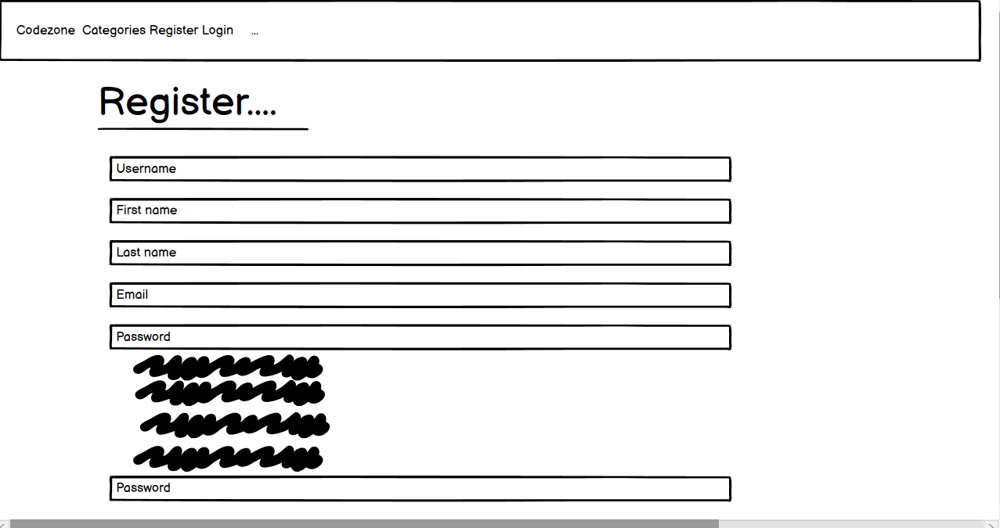
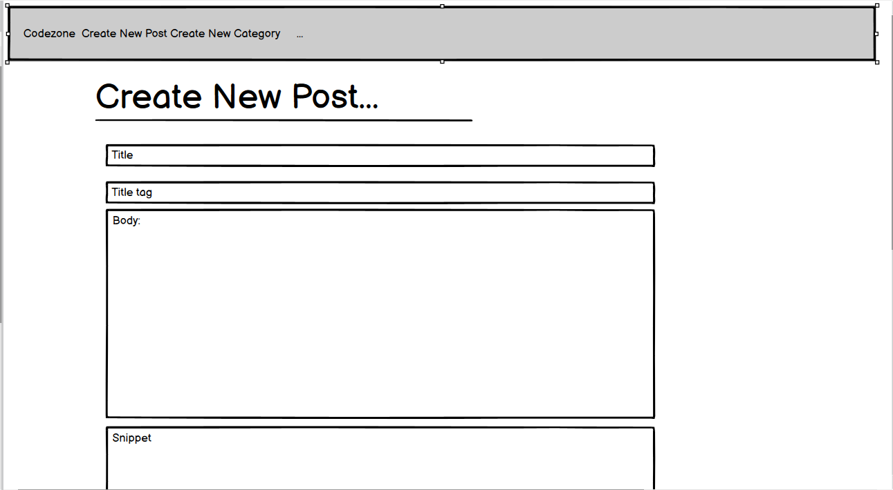
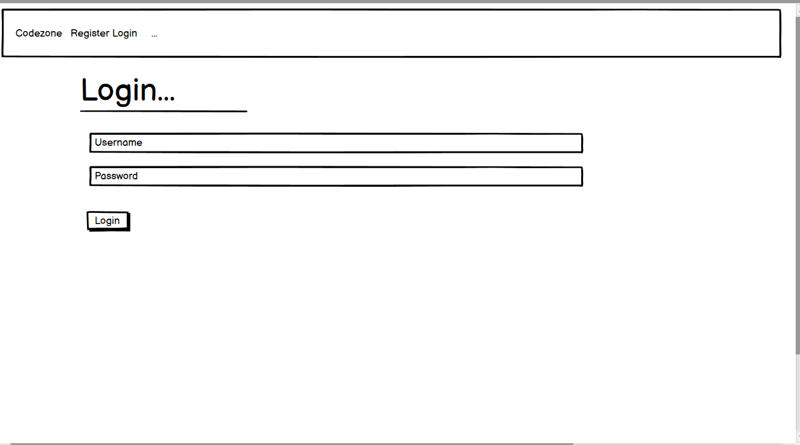

# Code Zone Blog

This blog is a place for experienced and budding developers alike to write and submit articles, and share feedback via likes/dislikes, comments and interacting with the coding community in general.

## Site Design (wireframes)

Homepage

Article detail (main post page)

Registration page

Create new post page

Login page

Create new category page

Edit profile page

## User stories

I used Github's story boards feature to plan in stages while building the site. Although I did find myself needing to add and or edit issues to the board at various stages throughout the project, I did find it extremely useful in temms of planning and implemintation.

[Link to Github User Stories for project](https://github.com/users/matt70iu/projects/4)

## Features

The user is greeted with the homepage with the homepage which contains the menu bar which contains a list of categories, while also giving the user the option to register or login.

If the user is not currently registered and wishes to register, they will clock on the register link at the top of the page.

The user is then asked to fill in relevent information, for account registration purposes such as username, name, email address and password.

The user is then redirected back to the login page to enter their newly created login details.

Once the user has logged in, they will be presented with a slightly different menu bar giving them the option to create a new post or category, as well as a drop down profile menu in the top right hand corner.

If the user selects Create New Post, they will be brought to a Create New Post page where they can enter a post, title, tag, category and snippet. (The snippet is what is displayed as a post summmary on the homepage).

When the user clicks Create New Post, their post will appears at the top of the posts list on the homepage.

They are also given the option to edit or delete their own posts.

The user can also choose to filter down posts by Category by selecting one of the categories from the dropdown menu.

Before creating a post, a user can also choose to create a new categoey by clicking on the Create New Category at the top of the page.

They will then be brought to a Create New Category Page where they can fill out the new category name and select Create New Category to add it to the list of available categories.

### Account/Profile Features

Under the dropdown profile menu on the right hand side, a user can choose to edit their settings. They are then brought to a page which displays text fields of username, first name, last name, last login and email.

The user can then choose to update any of these settings by clinking the Update Settings button, although, the last login, date joined and email fields must be populated. They will then be redirected to the homepage with a success message.

There is also a change password link, which will bring the user to a page to allow them to update their password.

Again, they may do so by simply clicking the change password button. They will then be redirected to the homepage with a success message.

While under in the profile menu, there is also the option to Edit Profile Page. This will then being the user to a page which will allow them to change various aspects of their profile, such as their bio, picture, website, instalgram, facebook and twitter urls.

A user can choose to leave any of these fields blank if they so wish, with the exception of the bio. Once update profile is clicked, the user will then be redirected to the homepage with a success message.

There is also the option to Show Profile page under the user profile menu. They will then be able to view a summary of all their public profile information they have provided, including name, picture, website, facebook, instagram and twitter, as well as their bio.

As is the case in the article detail page, the profile summary page will not display info or links for any areas in the users profile that may have been left blank.

Finally, for this menu, the user can also choose to logout, which will log them out and redirect them back to the homepage with a success message in a logged out state.

### Other Features

Ck Editor

This gives the user much more variety and features when creating a post, such as the ability to add formatting, links, images etc to their posts.

In relation to this feature however, I have been experiencing difficulties getting this editor to render properly in Heroku. This is a bug which I have yet to resolve, but hope to before project submission. 

If this bug cannot be resolved, I will simply replace with a text fields, although, this would be a setback for the project in terms of features.