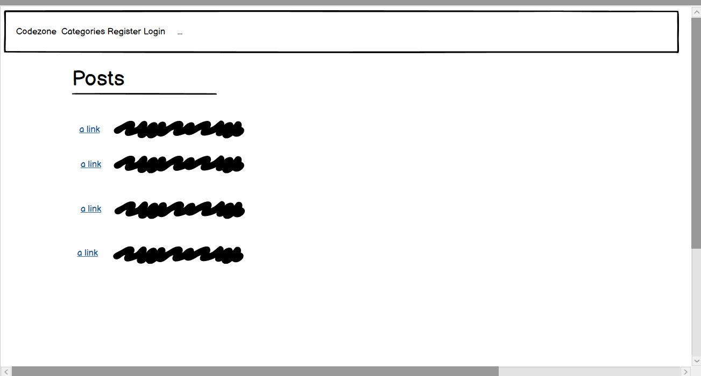
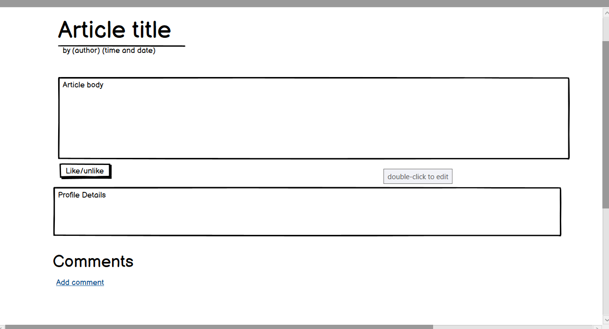
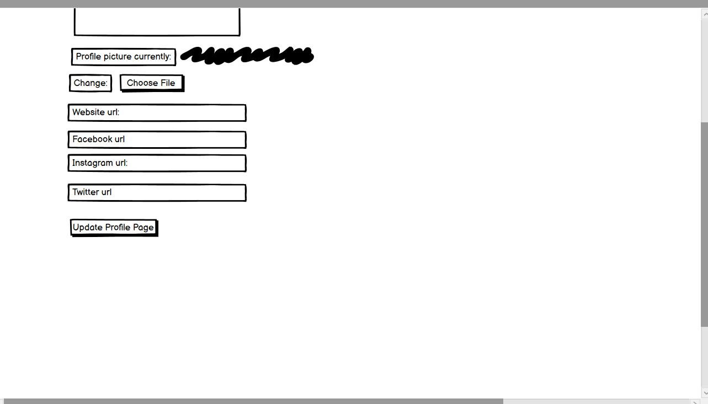
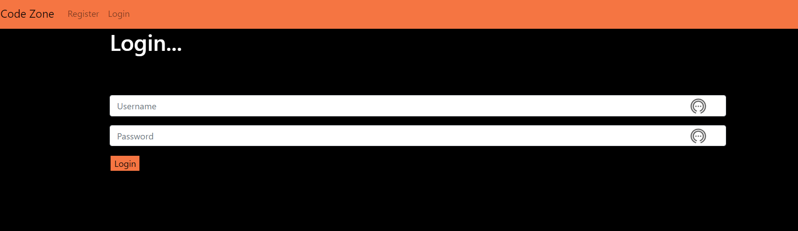
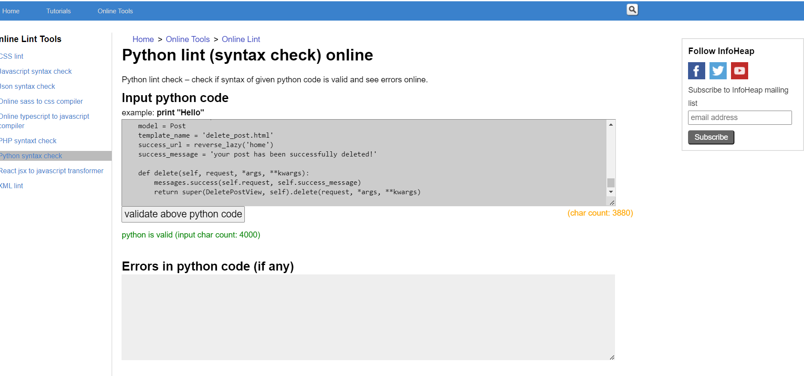
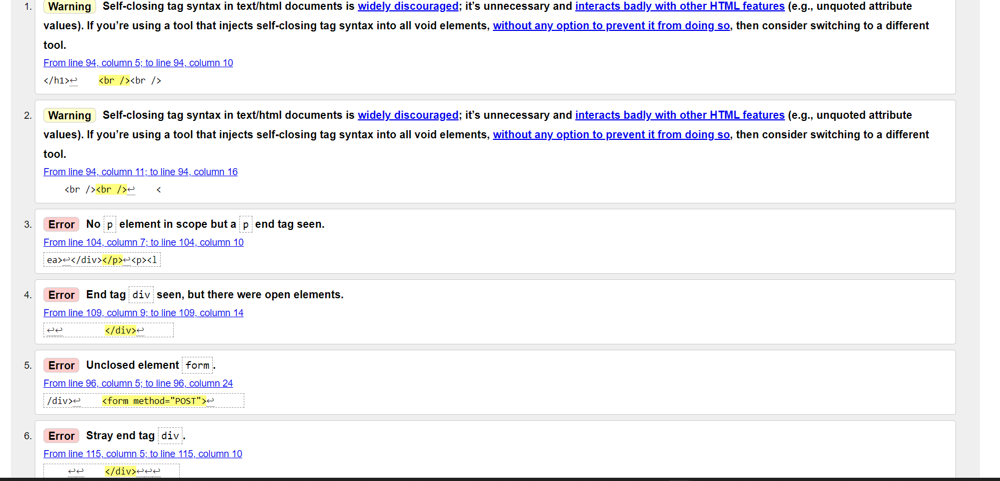

# Code Zone Blog

This blog is a place for experienced and budding developers alike to write and submit articles, and share feedback via likes/dislikes, comments and interacting with the coding community in general.

## Site Design (wireframes)

Homepage

Article detail (main post page)

Registration page

Create new post page

Login page

Create new category page

Edit profile page

## User stories/planning

I used Github's story boards feature to plan in stages while building the site. Although I did find myself needing to add and or edit issues to the board at various stages throughout the project, I did find it extremely useful in temms of planning and implemintation.

In building of the site, I did plan to use many external resourses to both improve my knowledge/abilites, as well as provide the site with some extra features.

### Models

As per the project requirements, the project must include CRUD functionality, so to that end my main models are going to consist of 4 main headings of profile, category, post and comment, some of which would require additional funtions within.

As well as what was included in the youtube tutorials and other reousrses that would assist me in building this project, I also wanted to add a time field to the post model as I feel it would be of beneifit for the user to know the time, as well as the date of a post.

## Features

The user is greeted with the homepage  which contains the menu bar which contains a list of categories, while also giving the user the option to register or login.

If the user is not currently registered and wishes to register, they will click on the register link at the top of the page.

The user is then asked to fill in relevent information, for account registration purposes such as username, name, email address and password.

The user is then redirected back to the login page to enter their newly created login details.

Once the user has logged in, they will be presented with a slightly different menu bar giving them the option to create a new post or category, as well as a drop down profile menu in the top right hand corner.

If the user selects Create New Post, they will be brought to a Create New Post page where they can enter a post, title, tag, category and snippet. (The snippet is what is displayed as a post summmary on the homepage).

When the user clicks Create New Post, their post will appears at the top of the posts list on the homepage.

They are also given the option to edit or delete their own posts.

The user can also choose to filter down posts by Category by selecting one of the categories from the dropdown menu.

Before creating a post, a user can also choose to create a new categoey by clicking on the Create New Category at the top of the page.

They will then be brought to a Create New Category Page where they can fill out the new category name and select Create New Category to add it to the list of available categories.

### Account/Profile Features

Under the dropdown profile menu on the right hand side, a user can choose to edit their settings. They are then brought to a page which displays text fields of username, first name, last name, last login and email.

The user can then choose to update any of these settings by clinking the Update Settings button, although, the last login, date joined and email fields must be populated. They will then be redirected to the homepage with a success message.

There is also a change password link, which will bring the user to a page to allow them to update their password.

Again, they may do so by simply clicking the change password button. They will then be redirected to the homepage with a success message.

While under in the profile menu, there is also the option to Edit Profile Page. This will then being the user to a page which will allow them to change various aspects of their profile, such as their bio, picture, website, instalgram, facebook and twitter urls.

A user can choose to leave any of these fields blank if they so wish, with the exception of the bio. Once update profile is clicked, the user will then be redirected to the homepage with a success message.

There is also the option to Show Profile page under the user profile menu. They will then be able to view a summary of all their public profile information they have provided, including name, picture, website, facebook, instagram and twitter, as well as their bio.

As is the case in the article detail page, the profile summary page will not display info or links for any areas in the users profile that may have been left blank.

Finally, for this menu, the user can also choose to logout, which will log them out and redirect them back to the homepage with a success message in a logged out state.

### Other Features

Ck Editor

This gives the user much more variety and features when creating a post, such as the ability to add formatting, links, images etc to their posts.

In relation to this feature however, I have been experiencing difficulties getting this editor to render properly in Heroku.

 This is a bug which I have yet to resolve, but hope to before project submission. 

If this bug cannot be resolved, I will simply replace with a text fields, although, this would be a setback for the project in terms of features.

As I have been unable to reliably resolve this issue with CK editor, I have been forced to remove it from the create/edit posts template.

### Features for future implementation

- Would like to implement some form of email validation. This could facilitate the launching of a possible news letter, buleton, or something similar in the future.

- A more feature rich home page with something like a "featured posts" section could improve the overall appeal of the homepage.

- Allow user to express other opinions rather than just a like an unlike button. Could maybe have a whatsapp/facebook messenger style list of emojis.

- A few visual tweeks to various visual elements of the site such as the view profile page for example, rather than just having a simple rectangle with profile info, round off the photo and improve the layout of the page etc.

- In addition, I would also like to be able to properly implement Ck editor to improve user experience.

### Technologies Used

- Python 

- Django

- HTML

- CSS

- Javascript 

- Gitpod (to build project)

- Heroku, github and cloudinary (for deployment)

- Microsoft visual studio code (to work on project while offline)

# Testing

I have completed a seperate test file [here](TESTING.md) which goes through all manual testing completed for this project.

## Validator testing

### Mainblog app:

Main blog admin.py

Main blog apps.py

Main blog forms.py

Main blog models.py

Main blog urls.py

Main blog views.py

### Signup app:

Sign up apps.py

Sign up forms.py

Sign up urls.py

Sign up views.py

### HTML validation (Sign up templates)

Change password.html

Create user profile.html

- Errors on this result caused by imported django UserChangeForm. Confirmed with CI tutor Alex that this was ok once documented.

Edit Settings form

Login form

User registration form

- Errors on this result caused by imported django UserChangeForm. Confirmed with CI tutor Alex that this was ok once documented.

### HTML validation (Main blog templates)

Article detail page

- These errors are caused by bootstrap template/Python code in doc.

Base html

Categories page

- Errors caused by imported Deleteview as per above.

Detete post page

Home page html

New category page

New comment page

- Errors caused by imported Createview as per above.

New post page

- Errors caused by imported Update view as per above.

Update post page

## Deployment

Setting up a new repository on Github:
1. Log into Github.
2. In my case, I wanted to build the repository using the one of code institute's templates.
3. Within the relevent repository I selected "use this template".
4. Git hub then created the new repository, which could later be linked into Heroku for deployment.

The app was deployed to Heroku via Github. The steps to deploy are as follows:

1. Log into Horku and select "new" and then select "Create new app".
2. Select an app name and region and select "create app".
3. Select your newly created app from your dashboard and click the settings tab.
4. Add any config Vars or build packs needed for app, in this case, PORT 8000 config vars and Python and nodejs for  build packs, remembering to ensure Python is your first build pack.
5. Click the "Deploy" tab and under "Deployment Method" select "Github Pages".
6. Log into Github and select correct repository to connect to app.
7. For convenience, I selected "Automatic Deploys" so the app is updated automatically after each push from Gitpod/Visual Studio code.

Making a local clone:

1. Login to gitbub and download github desktop.
2. Select the correct repository from the dropdown list in the top left.
3. Secect the 'repository' menu and from it select 'pull'.
4. Select 'open in visual studio code' from the home screen.
5. The repository can now be worked on locally, without the need to use gitpod etc.

Forking the repository:

1. Login to Gitbut and select the relevent repository.
2. At the top the the repository (not page), select settings.
3. Then select fork. I am currently not able to fork the repository as I own it, but this this the procedure one would normally follow.

## Libraries/resources used

### Bootstrap (version 4.5)

- Bootstrap was used to build the main navbar and site navigation contained in base.html, as well as for buttons and cards, the buttons being useed for form submission and the card being used to display profile info etc.

- This was then customised using css/html for site colours and formatting.

- Built in bootstrap javascript was also used to set up timouts for notification messages.

### Ck editor

- As mentioned in the features section, this was used on the create post/edit post pages in order to give the user more editing and feature options when creating a post.

- I hope to be able to impleamant this feature fully for project submission once previously mentioned bug is resolved.

- As mentioned above, I have had to remove this feature for submission, but hope to resolve rendering issue in the future.

### Content

- All content is for illustrative purposes and was obtained from the code institute course content.

## Credits

- ### [Codemy.com](https://www.youtube.com/playlist?list=PLCC34OHNcOtr025c1kHSPrnP18YPB-NFi) (link to playlist)

- [Login/out Views tutorial](https://www.youtube.com/watch?v=CTrVDi3tt8o&list=PLvKMZpikrDZrlpSAnZbJR8NUf2Ppjkht2&index=8&t=456s)

- [Channel link](https://www.youtube.com/c/Codemycom) (Codemy.com)

- This playlist and channel was a fantastic guide which assisted me greatly in following the steps required to build codezone. It anabled me to build a basic, but functioning blog, using tools and features, other than that contained within the code institute course cirriculiam. This helps give me a broder experience base for expanding my knowledge of Python, Django, Javascript, CSS and HTML.

- I also used a video from codemy.com to assist in building my login/out view function based view as I had great diffcuulty getting a log in or out success message to display when using class based views.

 [Code institue FST (Full stack frameworks module)](https://codeinstitute.net/ie/)

- I really appreciated the way this module was structued in the sense that it starts you out with the basics of django with the building of a basic task list with no styling, to finally finish with a fully functioning blog which one can then build on.

- I also used this module to assist in laying the ground work for early deployment for this current project, such as getting django installed, and getting Heroku correctly configured.

- In addition, I would also like to be able to properly implement Ck editor to improve user experience.

- The "messages" video in the " I think therefore I blog" section of the LMS was used to assist me in setting up the timeout script for the notification messages and then customised.

[Slackoverflow.com](https://stackoverflow.com)

- I used slack overflow countless times to assist in solving the countless errors and bugs I experienced while building this project.

- I very often found that I could literally copy and paste the error I was expreiencing into slack and locate a relevent article to assist.

### Acknowledgements

- My Mentor Dario for his help, advise and patience.
- The various totors at code institute for their help and patience in helping me build this project.
- The youtubers and slackoverflowers who take the time to create the videos, wrtite the articles and answer the questions. Without you all, newbies like me, really would be lost.

