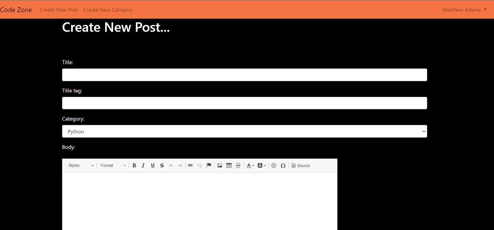
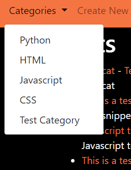

# Code Zone Testing

## Login/Logout

The purpose of this test is to ensre that the user can log in and out with a success message displayed.

The user is presented with the homepage which contains all posts in a list format.

To login, the user must select the login button.

They will then be asked to enter their username and password.

After entering the required info, they must then click the login button.

If all credentials are correct, a success message will confirm to the user that they are now logged in.

The homepage now gives the user the option to filter by categoey, create a new post, or create a new categoey.

The logged in user is also displayed with a dropdown menu in the top right of the page, which contains the option to logout.

The user simply needs to click logout and they will be greeted with a logout success message and be brought back to the homepage.

If a user attempts to enter invalid details at the login screen, they are also presented with an error message.

I can confirm after this test, that the app has behaved as expected.

## Register New User

The purpose of this test is to ensure that a new user can register a new account and then complete a successful login.

From the homepage, the user must click on register to create a new account.

They will then be presented with a registration page.

Once the user has filled out all the required details, they will be redirected back to the login page, with a message confirming successful registrtion and requesting that they log in.

The registration page also contains built in validation, which will not let the user proceed if they enter an invalid email or password for example.

I can confirm after this test, that the app has behaved as expected.

## Create New Post

The purpose of this test is to ensure that a user can add a new post to the blog.

In order to create a new post, the user must first be logged in. They must then click on the Create New Post button on the homepage.

They will then be presented with the Create New Post page

Once the user has filled out their post, addming any images etc if needed, they must then click on the Create New Post button.

The user will then be redirected back to the home page with a success message.

The create post form also contains validation, requiring a minmium of a post title, title tag and snippet.

During testing, I discovered a spelling mistake in the success message, which I have now corrected, other than that, the app behaved as expected.

## Edit a post

The purpose of this test is to confirm that a user can edit a post that they created.

A post can be edited in one of two ways.

From the homepage, the user can select Edit link attached to the post they wish to edit.

They can also select the edit link from the post/article detail page'

The user will then be presented with an Edit Post page.

The user can now make their changes to the relevent post and then click the Edit Post button at the bottom of the page.

The user will then be redirected to the homepage with a confirmation message that the edit was successful.

During testing, I discovered that the edit button was in a default bootstrap colour, changed colour to suit site theme.
Other than this, the app behaved as expected.

## Delete a post

The purpose of this test is to confirm that a user can delete a post that they created, while logged in.

A post can be deleted in one of two ways.

From the homepage, the user can select the delete link attached to the post they wish to delete. 

They can also choose the delete link from within the post itself.

Which ever option the user chooses, they will be directed to a Delete Post page.

The user then needs to click delete post and they will be redirected to the homepage with a message confirming successful deletion.

I can confirm after this test, that the app behaved as expected.

## Like/unlike post

The purpose of this test is to confirm that a logged in user is able to like/unlike a post.

In order for the user to like/unlike a post, they must first select the post they wish to like/unlike.

They will then be presented with the main post/article body.

At the bottom of the article, the user simply needs to click the like button in order to register their like.

I can confirm after this test, that the app behaved as expected.

## Comment on a post

The purpose of this test is to confirm that a user can add a comment to a post.

Within any post, the user can add a comment by clicking on the Add One... link at the bottom of the page.

The user will then be brought to the Add Comment page.

The user can then fill out their comment and submit by clicking the Add Comment button.

They will then be brought back to the home page with a success message.

During testing, I discovered that the add comment button was still the default bootstrap colour. I have ammended the add comment template to correct this, all else went as expected.

## Create a new category

The purpose of this test is to ensure a user can create a new category when logged in.

From the homepage, the user must select Create New Category.

They will then be presented with the create new category page.

The user then simply needs to type a category name and then click Create New Categoey.

The user will then be redirected back to the homepage with a success message confirming that the new category has been added.

I can confirm that the app behaved as expected after this test.

## Select a category from dropdown menu

The purpose of this test is to ensure that the homepage is filtered by the selected category that the user selects form the category dropdown menu.

I selected Python and was presented with the filtered results.

There was a couple of unexpected issues that came up here.

- The tags for the main article body are still showing.

- Issue with p tags showing rectified by inserting safe tag into template.

- The user is also presented with the option to edit/delete posts which they didn't create, although when they do this, they are told the action is not permitted.

- I have rectified the issue with the html/
 tags showing by adding the safe tag to the python code, so the html can be injected into the template.

- I have rectified the issue with the edit/delete options being available to users who did not create the post by adding an additional if and endif statment within the categories template.

- The categories page is now displaying without the option to edit/delete posts which do not belong to the user, as well as no longer displaying the template html tags.

## Authentication

The purpose of this thest is to ensure that a logged in user can only access pages they are permitted to and are presented with an error, should they try to access pages for which they have not been authenicated.

- When logged in as Matthew Adams, if i attempt to acces the page to delete the post, I am presented with the below error:

- I can confirm after this test, that the app behaved as expected.

