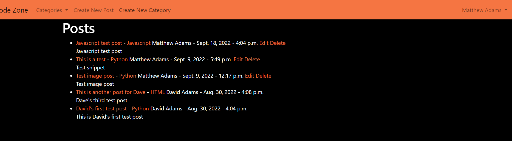

# Code Zone Testing

## Login/Logout

The purpose of this test is to ensre that the user can log in and out with a success message displayed.

The user is presented with the homepage which contains all posts in a list format.

To login, the user must select the login button.

They will then be asked to enter their username and password.

After entering the required info, they must then click the login button.

If all credentials are correct, a success message will confirm to the user that they are now logged in.

The homepage now gives the user the option to filter by categoey, create a new post, or create a new categoey.

The logged in user is also displayed with a dropdown menu in the top right of the page, which contains the option to logout.

The user simply needs to click logout and they will be greeted with a logout success message and be brought back to the homepage.

If a user attempts to enter invalid details at the login screen, they are also presented with an error message.

I can confirm after this test, that the app has behaved as expected.

## Register New User

The purpose of this test is to ensure that a new user can register a new account and then complete a successful login.

From the homepage, the user must click on register to create a new account.

They will then be presented with a registration page.

Once the user has filled out all the required details, they will be redirected back to the login page, with a message confirming successful registrtion and requesting that they log in.

The registration page also contains built in validation, which will not let the user proceed if they enter an invalid email or password for example.

I can confirm after this test, that the app has behaved as expected.

## Create New Post

The purpose of this test is to ensure that a user can add a new post to the blog.

In order to create a new post, the user must first be logged in. They must then click on the Create New Post button on the homepage.

They will then be presented with the Create New Post page

Once the user has filled out their post, addming any images etc if needed, they must then click on the Create New Post button.

The user will then be redirected back to the home page with a success message.

The create post form also contains validation, requiring a minmium of a post title, title tag and snippet.

During testing, I discovered a spelling mistake in the success message, which I have now corrected, other than that, the app behaved as expected.

## Like/unlike post

The purpose of this test is to confirm that a logged in user is able to like/unlike a post.

In order for the user to like/unlike a post, they must first select the post they wish to like/unlike.

They will then be presented with the main post/article body.

At the bottom of the article, the user simply needs to click the like button in order to register their like.

I can confirm after this test, that the app behaved as expected.

## Comment on a post

The purpose of this test is to confirm that a user can add a comment to a post.

Within any post, the user can add a comment by clicking on the Add One... link at the bottom of the page.

The user will then be brought to the Add Comment page.

The user can then fill out their comment and submit by clicking the Add Comment button.

They will then be brought back to the home page with a success message.

During testing, I discovered that the add comment button was still the default bootstrap colour. I have ammended the add comment template to correct this, all else went as expected.

